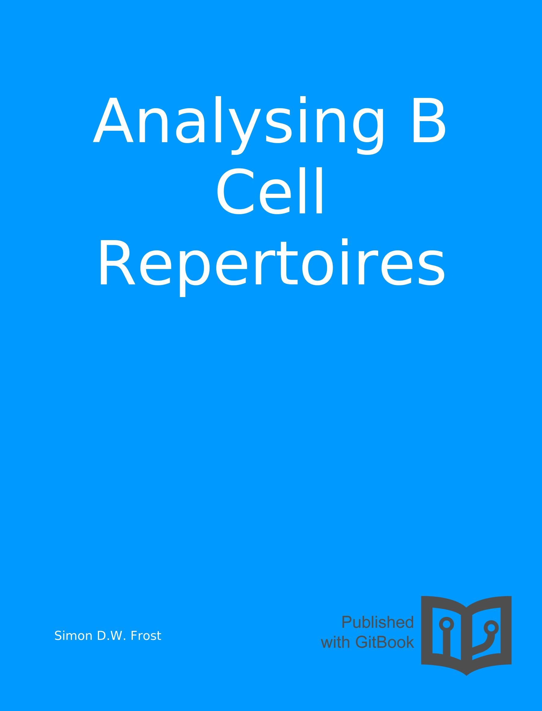

Lecture notes, examples, and exercises for 'Analysing B Cell Repertoires'.

These notes were generated using Gitbook (é and aron O'Mullan, 2014), knitr , and knitcitations .

Given that this work has benefited so much from open source software, all text and figures are licensed under the [Creative Commons CC0 1.0 Universal license](https://creativecommons.org/publicdomain/zero/1.0/), and all code is licensed under the [MIT License](http://opensource.org/licenses/MIT). Share and enjoy!
